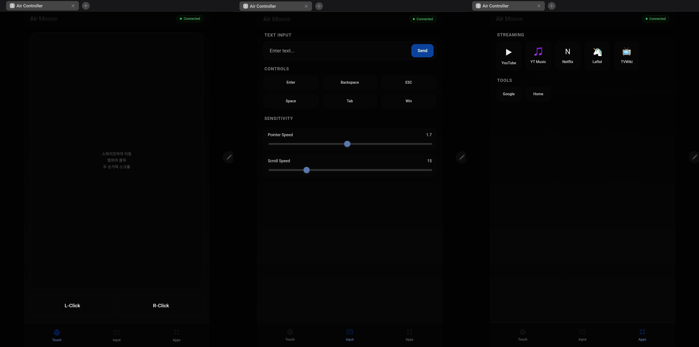

# 🎮 Air Controller

Transform your smartphone into a wireless mouse & keyboard for your PC.  
Perfect for controlling your laptop from the couch when connected to a TV.




## ✨ Features

- 📱 **Smartphone Touchpad**: Swipe to move mouse cursor
- 🖱️ **Gesture Support**: 
  - Single finger tap → Left click
  - Two finger tap → Right click
  - Two finger swipe → Page scroll
- ⌨️ **Text Input**: Type on PC using smartphone keyboard (voice input supported)
- 🚀 **Quick Launch**: One-touch access to YouTube, Netflix, Laftel, etc.
- ⚡ **Real-time Communication**: WebSocket-based for instant response with zero lag
- 🎨 **Modern UI**: Dark mode & Glassmorphism design
- 📱 **Responsive**: Supports smartphones, tablets, landscape/portrait modes

## 📥 Download

### For End Users (No Python Required)

**Download `AirController.exe` from the latest release:**

👉 [**Download Link**](https://github.com/vividhyeok/AirController/releases/latest)

1. Download `AirController.exe` from the link above
2. If Windows Defender shows a warning → Click "More info" → "Run anyway"
3. Allow firewall access when prompted

### For Developers / Source Code

```bash
git clone https://github.com/vividhyeok/AirController.git
cd AirController
pip install -r requirements.txt
python remote_server.py
```

## 🚀 How to Use

### Step 1: Run Server on PC

Double-click the downloaded `AirController.exe` or run from source:

```bash
python remote_server.py
```

A **QR code** and **connection URL** will appear in the terminal:

```
--- Remote Controller URL: http://192.168.0.10:5000 ---
███████████████████████████████
█ ▄▄▄▄▄ █▀ █▀▀██ ▀▄█ ▄▄▄▄▄ █
█ █   █ █▀ ▄ █▄▀ ▀█ █   █ █
...
--------------------------------------
```

### Step 2: Connect from Smartphone

**Important**: PC and smartphone must be on the **same Wi-Fi network**.

1. **Scan QR code** with your smartphone camera, or
2. **Open browser** (Chrome, Safari, etc.) and enter the displayed URL (e.g., `http://192.168.0.10:5000`)

### Step 3: Use the Remote

You'll see 3 tabs:

#### 🖱️ Touch (Touchpad)
- **Swipe on dark area**: Move mouse cursor
- **Single tap**: Left click
- **Two finger tap**: Right click
- **Two finger swipe**: Scroll up/down

#### ⌨️ Input
- **Text input field**: Type using smartphone keyboard (voice input works!)
- **Quick keys**: Enter, Backspace, ESC, Space, etc.
- **Sensitivity**: Adjust mouse/scroll speed

#### 🚀 Apps (Shortcuts)
- One-touch launch to YouTube, Netflix, etc.
- Customizable (requires code modification)

## 🛠️ Tech Stack

- **Backend**: Python, Flask, Flask-SocketIO
- **Frontend**: HTML5, CSS3 (Glassmorphism), JavaScript (Socket.IO)
- **Control**: PyAutoGUI, Pyperclip
- **Build**: PyInstaller

## 💡 Use Cases

- 🛋️ Watch YouTube on TV from the couch
- 🎬 Browse Netflix in bed without a keyboard
- 🎮 Wireless remote for presentations
- 🖥️ Control media center PC from anywhere in the room

## 🔧 Advanced Configuration

### Change Port

Edit `remote_server.py` to change the port number:

```python
port = 5000  # Change to desired port
```

### Customize Shortcuts

Modify buttons and URLs in the "Apps" section of `templates/index.html`.

### Build .exe Yourself

```bash
pip install pyinstaller
.\build_exe.bat
```

Built file will be in the `dist` folder.

## 📋 System Requirements

- **PC**: Windows 10 or later (macOS, Linux supported via source code)
- **Smartphone**: Modern web browser (Chrome, Safari, Samsung Internet, etc.)
- **Network**: PC and smartphone must be on the same Wi-Fi

## 🐛 Troubleshooting

### Q: Can't connect from smartphone
- Ensure PC and smartphone are on the same Wi-Fi network
- Check Windows Firewall allows the program
- Check if antivirus is blocking the connection

### Q: Mouse is too fast/slow
- Go to "Input" tab → "Sensitivity" section to adjust

### Q: Text input doesn't work
- Uses clipboard paste method (pyperclip) which works in most apps
- May be restricted in some secure applications or games

## 📄 License

MIT License - Free to use, modify, and distribute.

## 🙏 Contributing

Report bugs or suggest features in [Issues](https://github.com/vividhyeok/AirController/issues)!

---

**Made with ❤️ for couch potatoes 🥔**
